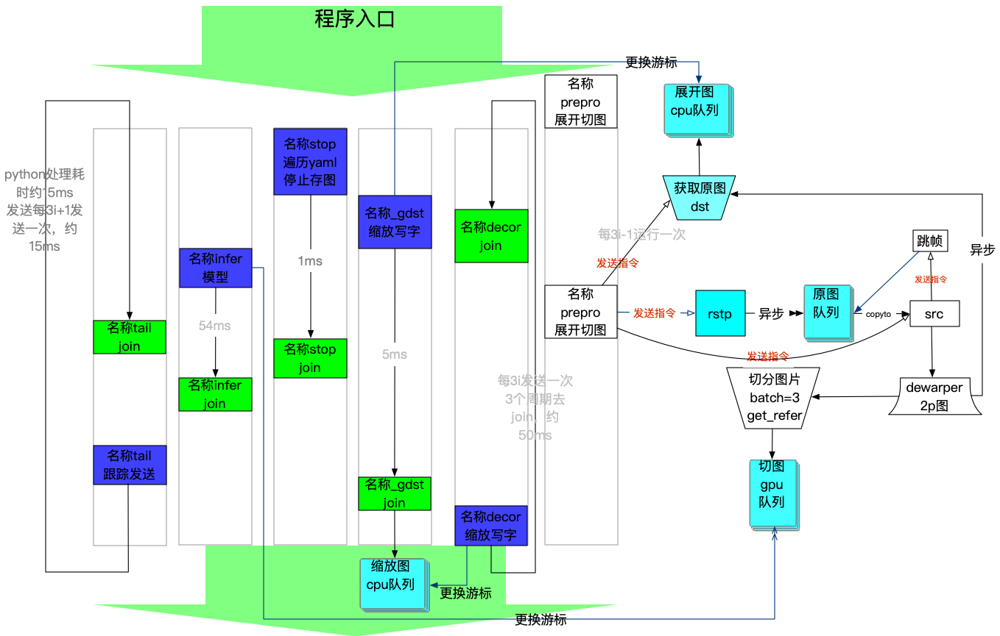

# RetinaNet & Fcos C++ Inference API - Sample Code

The C++ API allows you to build a TensorRT/Fcos engine for inference using the ONNX export of a core model.

The following shows how to build and run code samples for exporting an ONNX core model (from RetinaNet Fcos or other toolkit supporting the same sort of core model structure) to a TensorRT engine and doing inference on images.

## Building

Building the example requires the following toolkits and libraries to be set up properly on your system:
* A proper C++ toolchain (MSVS on Windows)
* [CMake](https://cmake.org/download/) version 3.9 or later
* NVIDIA [CUDA](https://developer.nvidia.com/cuda-toolkit)
* NVIDIA [CuDNN](https://developer.nvidia.com/cudnn)
* NVIDIA [TensorRT](https://developer.nvidia.com/tensorrt)
* [OpenCV](https://opencv.org/releases.html)

### Linux
```bash
cd fh_tracking && sh gcc.sh && cd ..
cd dewarp && make && cd ..
mkdir build && cd build
cmake -DCMAKE_CUDA_FLAGS="--expt-extended-lambda -std=c++11" ..
make
```
## structure
- Aims: A model will detecte person on a fisheye photo, and give it's tracking path for every one after read multi photos.
- shedual: 
    - infer_.cpp as main function. 
    - It will call 'modual dewarp' to dewarp fisheye photo. In which, perimeter of a fisheye is generated, as a rectangle ones, called '2p' photo and with 1920*2880 in gengenal.
    - using fcos, a tensorRT engine to detect person, located in 'csrc'
    - using python code[in py_extension], which call 'fh_tracking' to track boxes.
    - if you want get base map(only 2p is suppport now),you can run commond `python runProject.py g 1`
    - after all the processes done, image with tracking line will send to local home by ToDB.py 


    
    
## Evalution
Using Export.sh can generate multi-scale TensorRT engine.
To test the eclipse, the code `evalution/test_infer.py` can help you.
To test the precision on coco, you can use code `evalution/map_FE.py`
For testing both(eclipse & precision), run `sh evalution/sh.sh`

## Running

Load the ONNX core model and export it to a RetinaNet TensorRT engine (using FP16 precision):
```bash
./export model.onnx engine.plan
```

You can also export the ONNX core model to an INT8 TensorRT engine if you have already done INT8 calibration:
```bash
./export model.onnx engine.plan INT8CalibrationTable
```

Run a test inference:
```bash
cd build
export DISPLAY=:0.0
python runProject.py s 1 # start
python runProject.py e 1 # end
python runProject.py g 1 # get base map
```

Note: make sure the TensorRT, CuDNN and OpenCV libraries are available in your environment and path.

We have verified these steps with the following configurations:
* DGX-1V using the provided Docker container (CUDA 10, cuDNN 7.4.2, TensorRT 5.0.2, OpenCV 3.4.3)
* Jetson AGX Xavier with JetPack 4.1.1 Developer Preview (CUDA 10, cuDNN 7.3.1, TensorRT 5.0.3, OpenCV 3.3.1)


